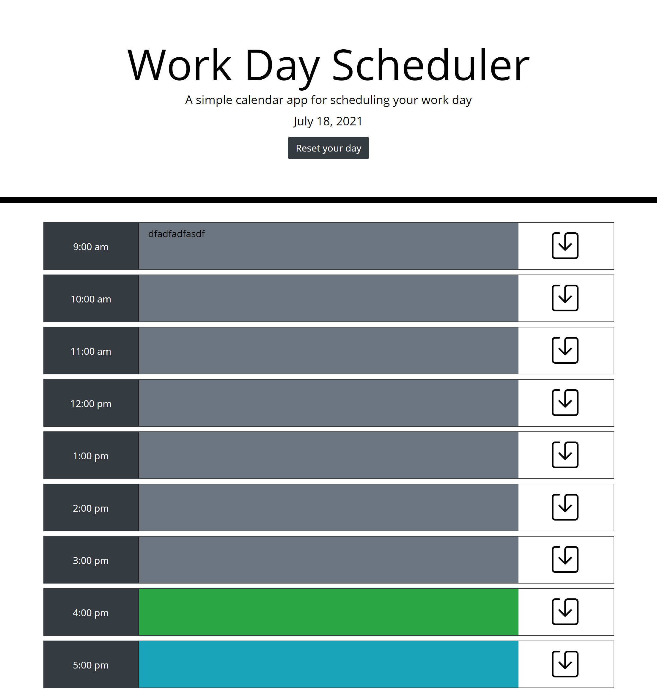

# Work Day Scheduler

## Description
This site will allow you to set up events/tasks that you need to get done during the day. While also persisting even when you leave and come back to the site. It will also allow you to easily clear the previous days data with the reset button at the top.

## Features
- Ability to edit a time slot with task
- Task is saved to local storage
- Reset button empites out the day
- Background color of text area changes depending on past preset or future
- Site shows the current day
- Site updates every 1 min

## Future Updates
- Futher mobile support

## Links
[Github Page](https://zunaty.github.io/workday-planner/)

## Site Preview

